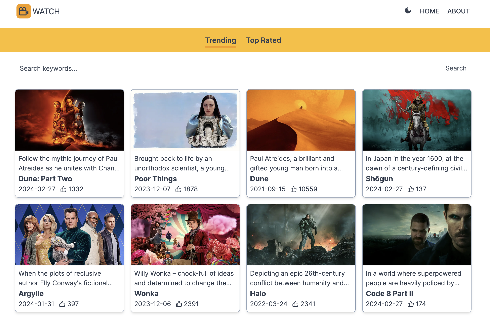

# IMDb Movie Watch App

An application that allows users to explore movies from the IMDb database.

## Features

- View popular movies.
- Search for movies based on keywords.
- View detailed information about each movie.
- Toggle between light and dark mode.

## Technologies Used

- [Next.js](https://nextjs.org/) - React framework for building the app.
- [Tailwind CSS](https://tailwindcss.com/) - Utility-first CSS framework.
- [next-themes](https://github.com/pacocoursey/next-themes) - Theme support for Next.js.
- [React Icons](https://react-icons.github.io/react-icons/) - Icons for the UI.

## Getting Started

1. **Clone the repository:**

   ```bash
   git clone https://github.com/samarkand-fr/next-movie.git

2. **Install dependencies:**
   - cd movie-next-app
   - npm install

3. **Run the development server:**
   - npm run dev
   - Open http://localhost:3000 in your browser.

## Usage
Navigate through the app to explore popular movies and search for specific movies using the search box.
Click on a movie to view detailed information.
Toggle between light and dark mode using the theme switcher.